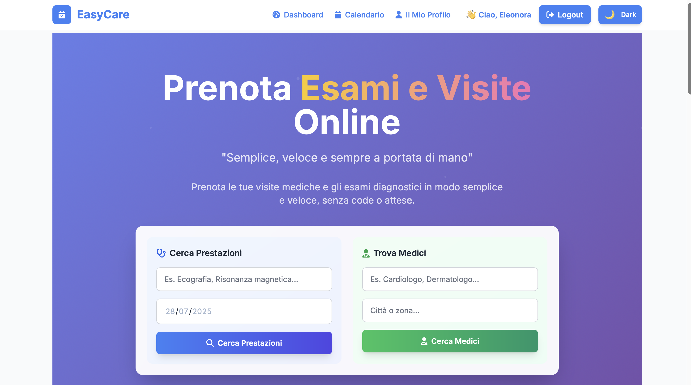
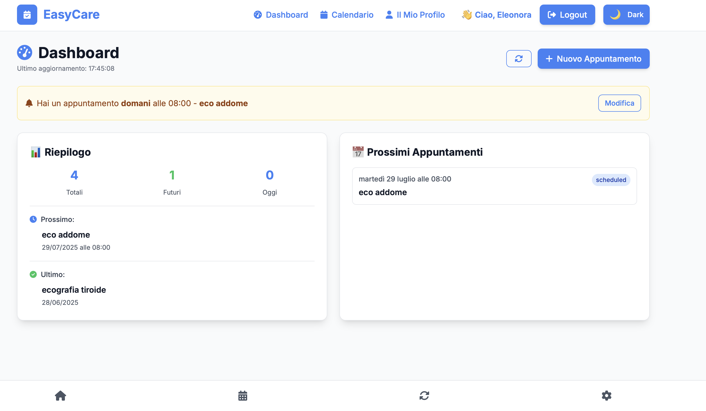

# 🗓️ Appuntamenti Booking App


Gestione appuntamenti per studi medici, centri estetici, parrucchieri e professionisti.  
Prenota, modifica e gestisci gli appuntamenti in modo semplice e rapido.  
✨ **Full Stack App con React + Express + MongoDB**

---

## 📸 Anteprima





> Schermata iniziale: l'utente può cercare una prestazione e selezionare una data per trovare medici disponibili. L'interfaccia è moderna, chiara e **responsive**, con **tema chiaro/scuro** attivabile.

---

## 📦 Tecnologie utilizzate

- ⚛️ React (Vite)
- 🎨 Tailwind CSS
- 🔐 JWT per l'autenticazione
- 🌍 Node.js + Express
- 🧾 MongoDB Atlas
- 🔐 Google OAuth 2.0
- ☁️ Vercel (frontend)
- 🛠 Render (backend)

---

## 🚀 Funzionalità

- ✅ Login / Registrazione utente classica
- ✅ Login con Google (OAuth 2.0)
- ✅ Ruoli: paziente 👤 / medico 👨‍⚕️
- ✅ Dashboard personale con gestione appuntamenti
- ✅ Calendario con appuntamenti visualizzati tramite indicatori colorati
- ✅ CRUD appuntamenti (Crea / Modifica / Elimina)
- ✅ Filtra appuntamenti per mese/anno (ottimizzazione caricamento)
- ✅ Tema chiaro / scuro 🌗 con toggle
- ✅ Ricerca per prestazione + selezione data 📅
- ✅ Design responsive mobile-first 📱
- ✅ Invio email conferma appuntamento 📧
- ✅ Pagamento in app
- ✅ Modifica del profilo utente

---

## 🖥️ Installazione locale

### 📋 Prerequisiti

- 📦 Node.js (versione 14 o superiore)
- 🐙 Git
- 💻 Un editor di codice
- 🧾 Account MongoDB Atlas
- 🔐 Google Developer Console (per OAuth)
- 📧 Account SendGrid (per email)

### 🚀 Installazione

#### 1. 📥 Clona il repository

```bash
git clone https://github.com/EleonoraTroiani/Appuntamenti-booking-app.git
cd Appuntamenti-booking-app
```

#### 2. 🛠️ Configura il backend

```bash
cd backend
npm install

# Crea un file .env e inserisci:
PORT=4000
MONGO_URL=<TUA_STRINGA_MONGODB>
JWT_SECRET=<TUA_SECRET>
GOOGLE_CLIENT_ID=<CLIENT_ID>
GOOGLE_CLIENT_SECRET=<CLIENT_SECRET>
GOOGLE_CALLBACK_URL=http://localhost:4000/auth/google/callback
EMAIL_SENDER=<email_registrata_su_sendgrid>
SENDGRID_API_KEY=<API_KEY_SENDGRID>

npm run dev
```

#### 3. ⚛️ Avvia il frontend

```bash
cd ../frontend
npm install
npm run dev
```

---

## 🗂️ Struttura del progetto

```
Appuntamenti-booking-app/
├── 🛠️ backend/
│   ├── 📂 controllers/
│   ├── 🔒 middleware/
│   ├── 📊 models/
│   ├── 🛣️ routes/
│   ├── 🔧 utils/
│   └── 🚀 server.js
├── ⚛️ frontend/
│   ├── 📁 public/
│   ├── 📂 src/
│   │   ├── 🎨 assets/
│   │   ├── 🧩 components/
│   │   ├── 🔄 context/
│   │   ├── 📄 views/
│   │   ├── 📱 App.jsx
│   │   └── 🎯 main.jsx
├── 🔐 .env.example
├── 📋 README.md
└── 📸 screenshots/
```

---

## 🎯 Come usare l'app

### 👤 Per i pazienti

1. 🔍 **Cerca una prestazione** dalla homepage
2. 📅 **Seleziona una data** per vedere i medici disponibili
3. ⏰ **Prenota un appuntamento** scegliendo orario e medico
4. 📧 **Ricevi conferma** via email
5. 🏠 **Gestisci** i tuoi appuntamenti dalla dashboard

### 👨‍⚕️ Per i medici

1. 📝 **Registrati** come medico
2. ⚙️ **Configura** la tua disponibilità
3. 📊 **Visualizza** tutti i tuoi appuntamenti
4. ✏️ **Modifica** o cancella appuntamenti
5. 📈 **Monitora** le tue prenotazioni

---

## 🔧 Configurazione avanzata

### 🌐 Variabili d'ambiente

Crea un file `.env` nella cartella `backend/` con le seguenti variabili:

```env
# 🌍 Server
PORT=4000

# 🧾 Database
MONGO_URL=mongodb+srv://<username>:<password>@cluster.mongodb.net/<dbname>

# 🔐 JWT
JWT_SECRET=your-super-secret-jwt-key

# 📧 Google OAuth
GOOGLE_CLIENT_ID=your-google-client-id
GOOGLE_CLIENT_SECRET=your-google-client-secret
GOOGLE_CALLBACK_URL=http://localhost:4000/auth/google/callback

# 📧 SendGrid Email
EMAIL_SENDER=your-verified-sender@example.com
SENDGRID_API_KEY=your-sendgrid-api-key
```

### 🗄️ Setup MongoDB

1. Crea un account su [MongoDB Atlas](https://www.mongodb.com/atlas)
2. Crea un nuovo cluster
3. Configura un utente database
4. Ottieni la connection string
5. Sostituisci `<username>`, `<password>` e `<dbname>` nella variabile `MONGO_URL`

### 🔐 Setup Google OAuth

1. Vai su [Google Cloud Console](https://console.cloud.google.com/)
2. Crea un nuovo progetto o selezionane uno esistente
3. Abilita Google+ API
4. Crea credenziali OAuth 2.0
5. Aggiungi `http://localhost:4000/auth/google/callback` agli URI autorizzati

### 📧 Setup SendGrid

1. Crea un account su [SendGrid](https://sendgrid.com/)
2. Verifica il tuo dominio/email sender
3. Genera una API Key
4. Configura le variabili d'ambiente

---

## 🧪 Testing

```bash
# 🛠️ Backend testing
cd backend
npm test

# ⚛️ Frontend testing  
cd frontend
npm test

# 🚀 Test end-to-end
npm run test:e2e
```

---

## 🚀 Deploy

### ☁️ Frontend (Vercel)

1. 🔗 Connetti il tuo repository GitHub a Vercel
2. ⚙️ Configura la build command: `npm run build`
3. 📁 Imposta la output directory: `dist`
4. 🌐 Deploy automatico ad ogni push

### 🛠️ Backend (Render)

1. 🔗 Connetti il tuo repository GitHub a Render
2. 🚀 Crea un nuovo Web Service
3. ⚙️ Configura:
   - Build Command: `npm install`
   - Start Command: `npm start`
   - Environment: Node
4. 🔐 Aggiungi le variabili d'ambiente
5. 🌐 Deploy automatico

---

## 🎨 Screenshots aggiuntivi

---

## 🛣️ Roadmap

- [x] 📲 Autenticazione utenti (classica + Google OAuth)
- [x] 📖 Sistema di prenotazione appuntamenti
- [x] ✅ Dashboard per pazienti e medici
- [x] 📆 Calendario interattivo
- [x] 🌗 Tema chiaro/scuro
- [x] 📱 Design responsive
- [x] 📧 Email di conferma
- [x] 🔄 Notifiche push
- [x] 📱 App mobile (React Native)


---

## 🤝 Contribuire

Contributi, issues e feature requests sono benvenuti! 

### 🔄 Come contribuire

1. 🍴 Fai un fork del progetto
2. 🌿 Crea un branch per la tua feature (`git checkout -b feature/AmazingFeature`)
3. 💾 Committa le tue modifiche (`git commit -m '✨ Add some AmazingFeature'`)
4. 📤 Pusha sul branch (`git push origin feature/AmazingFeature`)
5. 🔀 Apri una Pull Request

### 📝 Convenzioni per i commit

- ✨ `:sparkles:` per nuove feature
- 🐛 `:bug:` per bug fix
- 📚 `:books:` per documentazione
- 🎨 `:art:` per miglioramenti UI/UX
- ⚡ `:zap:` per miglioramenti delle performance
- 🔧 `:wrench:` per configurazioni
- 🔒 `:lock:` per sicurezza
- 🚀 `:rocket:` per deploy

---


## 👩‍💻 Autore

**Nome:** Eleonora Troiani  
**Email:** codwithele@gmail.com  
**GitHub:** [EleonoraTroiani](https://github.com/EleonoraTroiani)
**LinkedIn:** [Eleonora Troiani](https://linkedin.com/in/eleonora-troiani)

---

## 🆘 Supporto

Hai bisogno di aiuto? 

- 💬 [Aprire un issue](https://github.com/EleonoraTroiani/Appuntamenti-booking-app/issues/new)
- 🐛 [Segnala un bug](https://github.com/EleonoraTroiani/Appuntamenti-booking-app/issues/new?template=bug_report.md)
- 💡 [Richiedi una feature](https://github.com/EleonoraTroiani/Appuntamenti-booking-app/issues/new?template=feature_request.md)
- 📧 [Contattami via email](mailto:codwithele@gmail.com)

---

## 📄 Licenza

Questo progetto è sotto licenza MIT - vedi il file [LICENSE](LICENSE) per i dettagli.

---

⭐ **Se questo progetto ti è stato utile, lascia una stella!** ⭐


